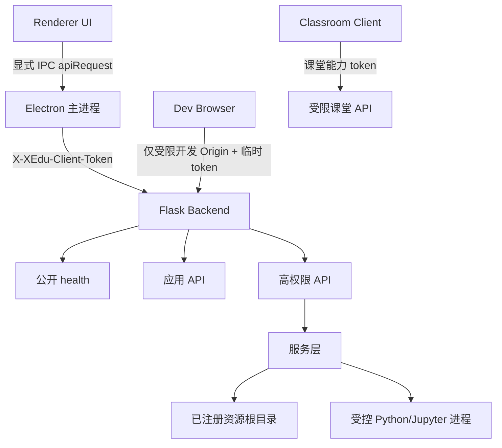

# XEdu Client 优化治理实施计划

> **For agentic workers:** REQUIRED SUB-SKILL: Use superpowers:subagent-driven-development (recommended) or superpowers:executing-plans to implement this plan task-by-task. Steps use checkbox (`- [ ]`) syntax for tracking.

**Goal:** 在不更换现有 Electron、Flask、原生 ES Modules 和 Scratch 技术栈的前提下，先消除跨站调用本机能力和凭据泄露风险，再恢复完整质量基线，最后降低核心模块的维护成本。

**Architecture:** 后端采用“公开健康检查、应用受保护 API、主进程高权限 API”三级边界。Electron 主进程持有本次启动的 API capability，Renderer 通过显式 IPC 请求调用后端；文件访问使用服务端注册的资源句柄，不再信任客户端提供的路径。完成安全止血后，按资源、进程、AI 代理和渲染层的职责拆分热点模块，并用完整 CI 门槛保护契约。

**Tech Stack:** Electron 39, Flask, Python 3.12, Vite, 原生 ES Modules, Node `node:test`, Pytest, Scratch GUI/VM 14.2。

## 当前执行状态（2026-07-16）

本次 Phase 0 Security Closure 安全止血已完成，具体实现队列和验收证据见
[Phase 0 Security Closure](/Users/apple/Documents/GitHub/xedu-client/docs/superpowers/plans/2026-07-15-xedu-client-phase-0-security-closure.md)。
当前证据为：后端 `125 passed`、Blockly `50 passed`、Scratch `18 passed`、
Student-shell `11 passed`、资源检查 `5 passed`、Electron 安全测试 `2 passed`，
Scratch/Vite 构建和 bundle 检查均通过。

2026-07-16 Phase 1 增量已完成：APIClient 已移除全局 `window.fetch` 劫持并覆盖
IPC、FormData、流式 fetch、超时和日志脱敏；重复 `escapeHtml` 已收敛到共享工具；
静态 Shell、文档搜索和 AI 输入已迁移到白名单 `data-action` 事件分发，并有契约测试。
`resources.js`、`index.html` 的组件化拆分、CSS 拆分和后端长服务拆分仍未宣称完成，
必须在这些边界继续补测试后再做结构性搬迁。

后续只允许从 Phase 1 开始：先做 APIClient、HTML escaping 和事件边界的
测试保护，再拆 `resources.js`、`index.html` 与 CSS。Scratch Track B、模型
按需下载和 Python 环境瘦身不得绕过已完成的 capability、opaque handle、
同源/归档校验和 Electron 隔离规则。Scratch 依赖审计发现的高危/严重漏洞
另建依赖治理任务，不在本次 Phase 0 安全完成声明中隐瞒。
父策略中未纳入本次 closure 的配置脱敏、通用 IPC 收窄和历史模块拆分项
仍保持未完成状态，不因本次安全收口而提前打勾。

## Global Constraints

- 不更换现有桌面、后端和前端技术栈；优化以边界收紧、测试补齐和渐进拆分为主。
- 默认后端只监听 `127.0.0.1`；局域网模式必须显式开启，并使用独立的课堂能力，不得复用本机高权限 capability。
- `/api/python/run`、配置写入、资源写入、发布、进程控制和任意路径访问均不得接受匿名或仅凭 Origin 的请求。
- 客户端不得把 API Key、Gitea Token、QuickForm 密码、教师口令等秘密返回给 Renderer 或日志。
- 客户端提供的路径只能引用服务端预先注册的课程根目录；Base64、URL 编码或其他可逆编码不构成授权。
- 不提交构建产物、`node_modules`、缓存、测试输出和包含真实凭据的配置文件。
- 每个任务必须先补一个能复现问题的测试，再写实现；任务完成后运行对应的聚焦测试和回归测试。
- 发布门槛必须包含后端、Renderer、Blockly、Scratch、打包检查和安全回归，不能只依赖 `npm run build`。

---

## 1. 现状与目标

### 1.1 已确认的基线

当前审查确认以下问题属于发布阻断项：

| 优先级 | 问题 | 影响 | 目标状态 |
| --- | --- | --- | --- |
| P0 | 全局 CORS 加上匿名 `/api/python/run` | 任意网页可诱导本机执行 Python；局域网模式下风险扩大 | 只有受信任的 Electron 主进程或明确授权的课堂请求可以执行 |
| P0 | `root_token` 只是可伪造的 Base64 路径 | 可读取任意本地文件，并可进一步写入 `.sb3` | 资源句柄由服务端生成、绑定根目录、短期有效且不可伪造 |
| P0 | `/api/load_config` 返回完整配置 | AI Key、Gitea Token、QuickForm 密码等可被跨站读取 | 普通配置和秘密分离；读取接口只返回脱敏 DTO |
| P1 | 通用 Electron IPC、开放 URL、本地 HTML 注入 | Renderer XSS 可升级为桌面能力调用 | preload 只暴露显式安全方法，URL、路径和协议全部白名单化 |
| P1 | CI 未覆盖完整测试集 | 回归无法阻断；当前已有后端和 student-shell 失败 | CI 与本地发布命令使用同一套完整门槛 |
| P2 | 资源、Gitea、Jupyter、主进程热点文件过大 | 变更半径大，职责边界逐渐失控 | 先建立接口测试，再按职责增量拆分 |

已知测试基线：后端为 `96 passed / 5 failed`；`student-shell` 为 `7 passed / 2 failed`。这些失败必须先被分类为“实现回归、环境依赖或测试契约过时”，不能通过删除测试或放宽断言消除。

### 1.2 完成定义

优化计划完成必须同时满足：

- 从非受信任 Origin 调用受保护 API 时返回 `401` 或 `403`，且响应不带允许读取的 CORS 头。
- 没有 capability 时，Python 执行、配置写入、资源写入、发布和任意文件读取全部失败。
- 资源句柄无法被客户端换成任意路径；路径穿越、绝对路径和非允许扩展名均被拒绝。
- `/api/load_config`、保存配置响应、日志和错误响应均不包含秘密值。
- Electron preload 不再暴露通用 `invoke(channel, ...args)`；外部 URL 只允许 `https:`，本地路径只能引用应用注册的路径。
- AI/文档内容不能通过 `javascript:`、`data:`、事件属性或未净化 HTML 进入 DOM。
- `python -m pytest backend/tests -q`、根项目测试、Scratch 测试、构建、bundle 检查和安全回归全部通过。
- 关键模块拆分后，旧 API 契约和课程资源仍通过集成测试；任何剩余的大文件都记录了下一步拆分边界。

## 2. 目标边界模型



原则：

- `health` 只返回运行状态、版本和非敏感诊断信息。
- 应用 API 要求本次启动 capability；请求必须同时满足 token、来源和方法级权限。
- 高权限 API 不由任意 Renderer 页面直接调用，由主进程转发并在后端再次校验。
- 课堂 API 使用独立的短期会话令牌和角色权限，不能读取本地配置秘密，也不能调用任意 Python 或任意路径资源。

## 3. 文件责任地图

本计划实施过程中，文件职责按以下边界调整。先添加边界模块和测试，再移动实现，避免一次性重写热点文件。

| 文件 | 责任 |
| --- | --- |
| `backend/api/security.py` | capability 生成、请求认证、Origin 校验、权限装饰器、统一 `401/403` 响应 |
| `backend/api/resource_runtime.py` | 服务端资源根目录注册、短期 opaque handle、句柄解析和路径校验 |
| `backend/api/routes/config.py` | 脱敏配置 DTO、配置读写权限和秘密字段的输入输出策略 |
| `backend/api/routes/python.py` | Python 执行权限、输入大小/超时/工作目录限制；不负责认证实现 |
| `backend/api/routes/resources.py` | 资源路由编排；具体文件访问委托 `resource_runtime.py` |
| `backend/api/app.py` | 注册安全中间件、路由和依赖，不在此处复制业务逻辑 |
| `backend/backend_main.py` | 生成/接收本次启动配置，明确监听地址和 capability 生命周期 |
| `electron/main/main.js` | 主进程持有 capability、显式 IPC handler、后端进程编排和 URL/路径白名单 |
| `electron/preload/index.js` | 只暴露命名方法，不暴露通用 channel 转发器 |
| `renderer/js/api.js` | 统一请求入口、超时取消、错误契约；优先通过 preload 请求后端 |
| `renderer/js/ai.js`, `renderer/js/docs.js` | 受控 Markdown/文档渲染、链接协议白名单和安全 DOM 更新 |
| `backend/tests/test_security_api.py` | API 认证、CORS、秘密脱敏、路径句柄和高权限路由回归 |
| `electron/test/` 或现有 Electron 测试目录 | IPC、URL、路径和 preload surface 测试 |
| `.github/workflows/ci-guard.yml` | 完整质量门槛和安全回归入口 |
| `docs/overview/api-contract.md` | 新的认证、脱敏、资源句柄和错误码契约 |
| `docs/overview/architecture-governance.md` | 更新分层边界、能力模型和模块拆分规则 |

## 4. 分阶段实施策略

### 阶段 0：冻结基线与建立安全回归

目标：在改实现前固定当前行为、失败列表和测试入口，避免后续把回归误判为优化结果。

**Files:**

- Create: `backend/tests/test_security_api.py`
- Create: `scripts/run_quality_gate.py`
- Modify: `package.json`
- Modify: `docs/overview/api-contract.md`
- Create: `docs/overview/optimization-baseline-2026-07-15.md`

**Interfaces:**

- `test_security_api.py` 使用 `api.app.create_app()` 和 Flask `test_client()`，不启动真实网络端口。
- `run_quality_gate.py` 顺序执行 Python 语法、Pytest、Renderer tests、Blockly tests、Scratch tests、Vite build 和 bundle 检查；任一步非零退出。
- 质量门脚本输出每个阶段的命令、退出码和耗时，不打印环境变量、配置内容或 token。

**Tasks:**

- [ ] 记录基线命令和结果：`python -m pytest backend/tests -q`、`npm run test:student-shell`、`npm run test:blockly-runtime`、`npm test --prefix scratch-editor`、`npm run build`、`npm run check:bundle`。
- [ ] 在 `test_security_api.py` 添加匿名请求矩阵，覆盖 `/api/python/run`、`/api/save_config`、`/api/load_config`、本地文件 GET、Scratch `.sb3` 写入、发布和进程控制。
- [ ] 为每个请求断言状态码、响应 JSON 契约、无 `Access-Control-Allow-Origin: *`，并对响应体执行秘密字符串扫描。
- [ ] 新增 `npm run quality-gate`，调用 `python3 scripts/run_quality_gate.py`；CI 和本地文档只引用这一入口，避免命令漂移。
- [ ] 运行聚焦安全测试，确认新测试在当前实现上按预期暴露失败，再进入阶段 1。

**验收：** 新安全测试能够稳定复现当前的匿名访问、CORS、秘密回显和伪造路径句柄问题；质量门脚本能在任意一步失败时返回非零。

### 阶段 1：收紧后端 API 信任边界

目标：消除任意网页到本机高权限接口的直接调用链。该阶段是所有后续工作的前置条件。

**Files:**

- Create: `backend/api/security.py`
- Modify: `backend/api/app.py`
- Modify: `backend/backend_main.py`
- Modify: `backend/api/routes/python.py`
- Modify: `backend/api/routes/config.py`
- Modify: `backend/api/routes/resources.py`
- Modify: `backend/api/routes/jupyter.py`
- Modify: `backend/api/routes/classroom.py`
- Test: `backend/tests/test_security_api.py`
- Test: `backend/tests/test_blockly_resources_api.py`

**Interfaces:**

- `create_capability() -> str` 使用 `secrets.token_urlsafe(32)` 生成本次进程令牌。
- `require_capability(scope: str)` 校验 `X-XEdu-Client-Token`，并检查 scope；失败统一返回 `{"success": false, "message": "unauthorized"}`。
- `is_allowed_origin(origin: str | None) -> bool` 只允许 Electron 应用来源和明确登记的开发 Origin，不接受 `*`。
- 高权限 scope 至少包含 `python:run`、`config:write`、`resource:read`、`resource:write`、`process:control`；课堂 scope 不得继承这些权限。

**Tasks:**

- [ ] 在 Flask 应用装配时注册 capability 校验和 Origin 策略；`/api/health` 保持匿名但只返回非敏感字段。
- [ ] 移除全局 `CORS(app)`；开发模式只对显式配置的 Vite Origin 返回精确 `Access-Control-Allow-Origin`，并始终带 `Vary: Origin`。
- [ ] 在 Electron 主进程生成或接收 capability，通过后端子进程环境变量传递；Renderer 不直接读取环境变量和令牌文件。
- [ ] 将 `/api/python/run` 改为只接受主进程转发的受保护请求；同时限制代码体积、超时、工作目录和可继承环境变量，并确保临时文件在 `finally` 删除。
- [ ] 为 `/api/save_config`、`/api/load_config`、Jupyter 进程控制、资源写入和发布路由添加明确 scope，不使用“只要带 Origin 就放行”的兼容分支。
- [ ] 为未带 token、错误 token、错误 scope、恶意 Origin 和 OPTIONS 预检分别添加测试。

**验收：** 非受信任网页无法读取或修改任何高权限 API；Electron 应用通过显式主进程路径仍能完成启动 Jupyter、运行课程代码、读取课程资源和保存项目。

**提交边界：** `security: protect local api with process capability`

### 阶段 2：替换可伪造资源句柄并保护文件写入

目标：让客户端只能访问服务端预先注册的课程资源，彻底移除“客户端选择根目录”的授权模型。

**Files:**

- Modify: `backend/api/resource_runtime.py`
- Modify: `backend/api/routes/resources.py`
- Modify: `backend/api/routes/resources_blockly.py`
- Modify: `backend/services/project_service.py`
- Modify: `renderer/js/api.js`
- Modify: `renderer/js/resources.js`
- Test: `backend/tests/test_blockly_resources_api.py`
- Test: `backend/tests/test_security_api.py`

**Interfaces:**

- `register_resource_root(root_path: Path, kind: str, owner: str) -> str` 返回服务端内存登记 ID。
- `issue_resource_handle(root_id: str, relative_path: str, operation: str, ttl_seconds: int = 300) -> str` 返回随机 opaque handle；handle 不包含路径。
- `resolve_resource_handle(handle: str, operation: str) -> Path` 校验存在性、过期时间、operation、根目录和 `Path.resolve()` 后的目录边界。
- 资源读取只允许课程所需扩展名；资源写入只允许 `.sb3`、明确的 Blockly 文件类型和规定大小。

**Tasks:**

- [ ] 将现有 Base64 `root_token` 解析替换为服务端注册表；注册表只保存规范化根目录、资源类型、所有者、创建时间和过期时间。
- [ ] 删除所有根据 URL 直接解码路径的逻辑；旧 token 不做静默兼容，返回明确的 `400` 或 `410` 并要求前端重新索取句柄。
- [ ] 统一检查绝对路径、`..` 穿越、符号链接逃逸、NUL 字节、超大文件和不允许扩展名。
- [ ] 将 Scratch `.sb3` 写入绑定到当前课程根目录和 `resource:write` scope，使用临时文件写入后 `os.replace`，避免半写入文件。
- [ ] 为读取 `/etc/hosts`、伪造任意根目录、路径穿越、符号链接、越权 `.sb3` 写入和过期 handle 添加回归测试。
- [ ] 更新 Renderer 资源索引流，使 API 返回 `resource_id/handle` 而不是本地绝对路径；删除依赖 `root_token` 拼 URL 的调用。

**验收：** 客户端无法通过改写任何 URL 字段读取或覆盖课程根目录之外的文件；合法课程资源和 Scratch 保存流程继续工作。

**提交边界：** `security: replace filesystem path tokens with resource handles`

### 阶段 3：分离配置秘密并建立脱敏契约

目标：任何 UI 配置读取、保存响应、错误信息和日志都不再暴露凭据。

**Files:**

- Modify: `backend/models/config.py`
- Modify: `backend/api/routes/config.py`
- Modify: `backend/api/routes/ai.py`
- Modify: `backend/services/ai_service.py`
- Modify: `backend/services/gitea_service.py`
- Modify: `renderer/js/main/system-config.js`
- Modify: `renderer/js/experience-config.js`
- Test: `backend/tests/test_security_api.py`
- Test: `backend/tests/test_ai_routing_api.py`

**Interfaces:**

- `AppConfig.to_public_dict() -> dict` 只返回 UI 所需非秘密字段。
- `AppConfig.to_secret_refs() -> dict` 返回秘密存储引用或存在性布尔值，不返回明文。
- `merge_config_update(payload: dict, *, allow_secret_write: bool) -> AppConfig` 明确区分普通字段和秘密字段，拒绝未知字段。
- 所有“测试配置”接口只返回 `configured: true|false`、服务状态和可展示错误，不返回请求中的 key/token/password。

**Tasks:**

- [ ] 把 `ai.api_key`、`ui.resources_publish_token`、`ui.classroom_teacher_code`、`ui.quickform.password` 从公共序列化路径移除。
- [ ] 保存配置时采用字段白名单；秘密字段只允许主进程或明确的 secret-write scope 更新，响应返回脱敏 DTO。
- [ ] 日志、异常和 AI 测试接口统一使用 `***` 或 `configured: true`，并增加通用 `redact_secrets()` 对嵌套字典和字符串做保护。
- [ ] Renderer 只保存配置状态，不在 DOM、localStorage、URL 参数或错误 Toast 中保留明文秘密。
- [ ] 添加测试：load/save 不含秘密键值、未知配置字段被拒绝、保存失败不回显请求体、AI test_config 不回显 key。

**验收：** 对所有配置路由的响应和日志做秘密扫描均无命中；已有 AI、Gitea、QuickForm 功能在已配置和未配置状态下都能区分显示。

**提交边界：** `security: separate secret config from public settings`

### 阶段 4：收窄 Electron、Renderer 和 HTML 渲染面

目标：即使普通 Renderer 内容被污染，也不能直接升级为任意 IPC、任意 URL 或任意本地路径能力。

**Files:**

- Modify: `electron/preload/index.js`
- Modify: `electron/main/main.js`
- Modify: `renderer/js/api.js`
- Modify: `renderer/js/ai.js`
- Modify: `renderer/js/docs.js`
- Modify: `renderer/index.html`
- Modify: `package.json`
- Test: `renderer/js/student-shell-contract.test.mjs`
- Create: `electron/test/preload-security.test.mjs`

**Interfaces:**

- Preload 只暴露命名方法，例如 `apiRequest(request)`, `openExternal(url)`, `openResource(handle)`；不得暴露 `invoke(channel, ...args)`。
- `openExternal(url)` 只接受 `https:`；`openResource(handle)` 只接受服务端句柄或应用已登记路径。
- `apiRequest({ method, path, body })` 由主进程添加 capability，并拒绝 Renderer 自行设置认证头。
- Markdown 渲染只允许预定义标签和 `http/https` 链接；禁止 `javascript:`, `data:`, `file:`, `vbscript:`, `on*` 属性和内联 style。

**Tasks:**

- [ ] 将通用 IPC bridge 替换为显式方法，并在主进程对每个 handler 做参数校验和来源校验。
- [ ] 对 `open-external`、`open-path`、`jupyter:create-view`、深链和本地 HTML 打开逻辑增加协议、路径、窗口来源和新窗口策略。
- [ ] 在 `renderer/js/api.js` 用 `AbortController` 实现真正的请求超时；删除无效的 `fetch({ timeout })` 参数。
- [ ] 为 AI Markdown 和文档内容引入固定允许列表的 sanitizer；链接创建时先解析 `new URL()`，只保留 `http:` 和 `https:`。
- [ ] 移除 CSP 中不必要的 `'unsafe-inline'`；对必须保留的 inline 代码迁移为外部脚本或使用 nonce。
- [ ] 添加 Node 测试覆盖恶意链接、事件属性、HTML 注入、非法 IPC channel、`file:`/`javascript:` URL 和未登记路径。

**验收：** 恶意 AI/文档内容只能作为安全文本或允许的 Markdown 元素显示；Renderer 无法调用未暴露的 IPC channel，也无法打开任意本地文件。

**提交边界：** `security: reduce electron renderer privilege surface`

### 阶段 5：恢复测试基线并把质量门槛接入 CI

目标：让“完整通过”成为可重复的命令，而不是 README 中的手工描述。

**Files:**

- Modify: `.github/workflows/ci-guard.yml`
- Modify: `package.json`
- Modify: `backend/requirements.txt`
- Modify: `backend/requirements_ci.txt`
- Modify: `backend/requirements_full.txt`
- Modify: `scratch-editor/package.json`
- Modify: `scratch-editor/package-lock.json`
- Modify: `README.md`
- Test: `backend/tests/`
- Test: `renderer/js/student-shell-contract.test.mjs`
- Test: `renderer/js/resources/student-workspace-utils.test.js`
- Test: `renderer/js/blockly/runtime-helpers.test.js`
- Test: `renderer/js/blockly/xeduhub-audit.test.js`
- Test: `scratch-editor/test/xedu-extension.test.js`

**Tasks:**

- [ ] 逐项修复当前后端 `5` 个失败测试；每项先判断是实现回归、测试契约失效还是环境依赖，保留失败原因记录。
- [ ] 修复 `student-shell` 的 `2` 个失败测试，确保工作台 API 契约和当前 DOM/模块边界一致。
- [ ] 将 `npm run test:student-shell`、`npm run test:resources-inspection`、`npm run test:scratch` 和安全测试纳入 CI。
- [ ] 增加 Python 语法、Renderer 语法、根项目构建、Scratch 构建和 Electron 打包 smoke；构建产物只用于校验，不提交到仓库。
- [ ] 统一依赖版本来源，固定直接依赖版本；在 CI 中运行 `npm audit --audit-level=high` 和对应的 Python 依赖审计，记录允许的临时例外及到期日期。
- [ ] 更新 README 的测试命令和当前限制，删除与实际结果不符的“全部通过”描述。

**验收：** 单次 `npm run quality-gate` 和 CI job 得到相同结果；缺少任意测试入口、依赖高危漏洞或 bundle 超限都阻断合并。

**提交边界：** `ci: enforce complete quality and security gate`

### 阶段 6：渐进拆分热点模块

目标：在安全和测试稳定后降低修改半径，不进行大规模无测试重写。

**拆分顺序：**

1. `backend/api/routes/resources.py`：拆为 `resource_index.py`、`resource_files.py`、`resource_course.py`、`resource_publish.py`，保留旧蓝图注册入口。
2. `backend/services/gitea_service.py`：拆为仓库生命周期、同步/发布、凭据和错误映射模块。
3. `backend/services/jupyter_service.py`：拆为命令构造、进程状态、端口和会话 URL 模块。
4. `electron/main/main.js`：拆为 `electron/main/backend-process.js`、`window-manager.js`、`ipc-handlers.js`、`deep-links.js`。
5. `renderer/js/resources.js` 和 `renderer/js/main.js`：只保留编排，业务状态、渲染和存储分别位于现有 `renderer/js/resources/*`、`renderer/js/main/*`。

**Files:**

- Create: `backend/api/routes/resource_index.py`
- Create: `backend/api/routes/resource_files.py`
- Create: `backend/api/routes/resource_course.py`
- Create: `backend/api/routes/resource_publish.py`
- Create: `backend/services/gitea_client.py`
- Create: `backend/services/gitea_publish_service.py`
- Create: `backend/services/gitea_pull_service.py`
- Create: `backend/services/jupyter_command.py`
- Create: `backend/services/jupyter_process.py`
- Create: `electron/main/backend-process.js`
- Create: `electron/main/window-manager.js`
- Create: `electron/main/ipc-handlers.js`
- Create: `electron/main/deep-links.js`
- Modify: `backend/api/routes/resources.py`
- Modify: `backend/api/routes/__init__.py`
- Modify: `backend/services/gitea_service.py`
- Modify: `backend/services/jupyter_service.py`
- Modify: `electron/main/main.js`
- Modify: `renderer/js/resources.js`
- Modify: `renderer/js/main.js`
- Reuse: `renderer/js/resources/resource-bindings.js`
- Reuse: `renderer/js/resources/resource-index-flow.js`
- Reuse: `renderer/js/resources/course-storage.js`
- Reuse: `renderer/js/resources/detail-renderer.js`
- Test: `backend/tests/` 中与资源、Gitea、Jupyter 对应的现有测试，并为每个新模块新增同职责边界测试
- Test: `electron/test/preload-security.test.mjs` 和 Electron 启动 smoke
- Test: `renderer/js/student-shell-contract.test.mjs`
- Test: `renderer/js/resources/resource-index-flow.test.js`
- Update: `docs/overview/architecture-governance.md`

**Tasks:**

- [ ] 每次拆分前先列出入口文件的公共函数、导入方和副作用；禁止边拆边改 API 契约。
- [ ] 先移动一类职责并保留兼容导出，再运行聚焦测试和完整质量门。
- [ ] 删除旧实现只在所有引用迁移且覆盖率/契约测试通过后进行。
- [ ] 为资源路由和 Electron IPC 保留端到端 smoke，避免“模块测试通过但装配断裂”。
- [ ] 每个新模块控制在单一职责和可独立测试范围内；超过约 800 行时必须重新说明边界，而不是继续堆叠。

**验收：** 拆分后的路由、服务和主进程模块可以单独测试，旧课程入口、API 路径、Scratch/Blockly 资源和 Jupyter 工作流无行为回归。

**提交边界：** 每个热点模块一个结构性提交，例如 `refactor: split resource route responsibilities`。

### 阶段 7：发布、监控与文档闭环

目标：把安全边界和质量门槛固化为后续开发的默认规则。

**Files:**

- Modify: `docs/overview/api-contract.md`
- Modify: `docs/overview/architecture-governance.md`
- Modify: `docs/overview/project-map.md`
- Modify: `README.md`
- Create: `docs/overview/security-boundary.md`
- Create: `docs/overview/release-checklist.md`

**Tasks:**

- [ ] 在 API 契约中记录认证头、scope、错误码、脱敏字段、资源句柄生命周期和开发模式 Origin。
- [ ] 在安全边界文档中列出所有高权限路由、主进程 IPC 方法和允许协议/路径；新增高权限入口必须更新该清单。
- [ ] 在发布清单中固定以下检查：干净构建、完整质量门、依赖审计、秘密扫描、打包 smoke、课程资源读写和 Jupyter 启停。
- [ ] 记录剩余风险：Python 执行本身仍是高权限能力，只能通过 capability、受控工作目录和用户明确触发使用；不能把它描述成沙箱。
- [ ] 对日志和错误监控增加 request id、路由、scope 和失败原因，但禁止记录 token、代码正文、路径中的敏感信息和配置秘密。

**验收：** 新开发者可以只阅读治理、API 契约和发布清单，理解如何添加路由、IPC 或资源访问而不重新引入匿名高权限入口。

## 5. 优先级、依赖与节奏

```text
阶段 0 基线与回归测试
          |
          v
阶段 1 API 信任边界 -----> 阶段 2 资源句柄 -----> 阶段 3 配置秘密
          |                         |
          +-------------------------v
                              阶段 4 Electron/Renderer
                                        |
                                        v
                              阶段 5 CI 与依赖门槛
                                        |
                                        v
                              阶段 6 模块渐进拆分
                                        |
                                        v
                              阶段 7 发布与治理闭环
```

建议节奏：

- 第一迭代：阶段 0、阶段 1，目标是关闭跨站代码执行和匿名高权限调用。
- 第二迭代：阶段 2、阶段 3、阶段 4，目标是关闭文件越权、秘密泄露和 Renderer 升权链。
- 第三迭代：阶段 5，目标是恢复所有测试并让 CI 能阻断回归。
- 后续迭代：阶段 6、阶段 7，目标是降低维护成本并固化规则。

不允许的顺序：在阶段 1 未完成前增加新的任意 Python、任意路径、通用 IPC 或远程课堂高权限能力；在阶段 5 未完成前以“构建成功”作为发布依据。

## 6. 风险与回滚策略

| 风险 | 处理方式 |
| --- | --- |
| Renderer 直连 API 改为主进程代理导致开发模式失效 | 保留明确的开发 Origin 和临时 capability，仅用于本地开发；生产构建不启用宽松分支 |
| 旧课程仍保存 `root_token` | 提供一次性迁移命令把旧路径映射为服务端注册资源；迁移后旧 token 直接失效 |
| 配置秘密从普通 JSON 移出导致旧版本无法读取 | 读取时只做一次受控迁移，迁移后立即写入新格式；不在响应中兼容回显秘密 |
| sanitizer 破坏教学 Markdown | 先用真实课程样本建立快照测试；允许列表只增加安全标签，不接受任意 HTML 回退 |
| 模块拆分产生导入循环 | 先定义单向依赖：路由 -> service -> runtime/util；禁止 service 反向导入路由 |
| 测试依赖或网络服务不稳定 | 将外部服务替换为 fixture/mock；健康检查只验证本地 Flask 装配，不把公网可达性当作测试前提 |

回滚原则：安全策略和测试先提交，业务拆分后提交。若某一阶段导致课程功能回归，只回滚该阶段的业务适配提交，不回滚 capability、秘密脱敏和安全回归测试。

## 7. 自检清单

- [ ] 每个 P0/P1 审查问题都有对应阶段、文件和回归测试。
- [ ] 没有使用“稍后补充”“适当处理”“增加测试”等未定义动作作为验收条件。
- [ ] 所有新接口都给出了输入、输出、权限和失败行为。
- [ ] 资源访问不再把客户端路径或 Base64 编码当作授权。
- [ ] Python 执行、配置、文件写入、发布和进程控制均纳入高权限 scope。
- [ ] CI 入口与本地质量门一致，失败时返回非零且不泄露秘密。
- [ ] 模块拆分安排在安全和质量基线之后，且保留兼容入口和集成测试。
